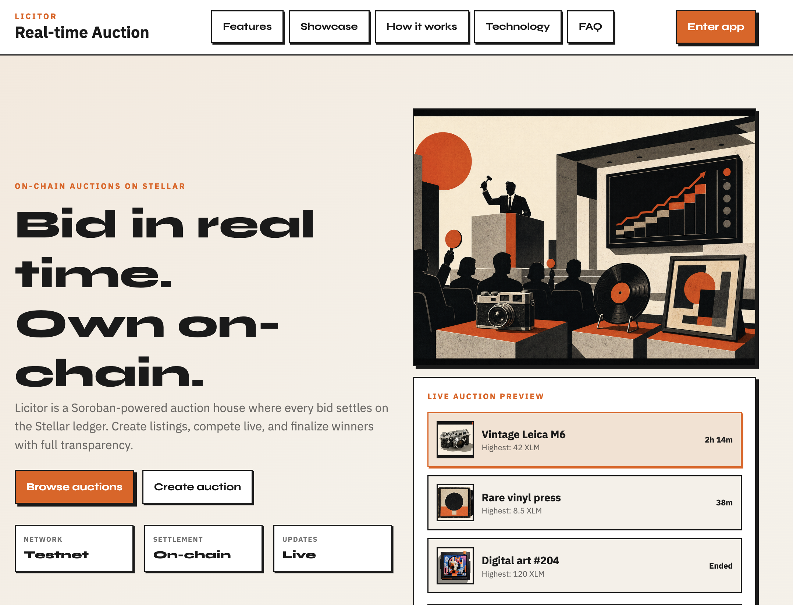
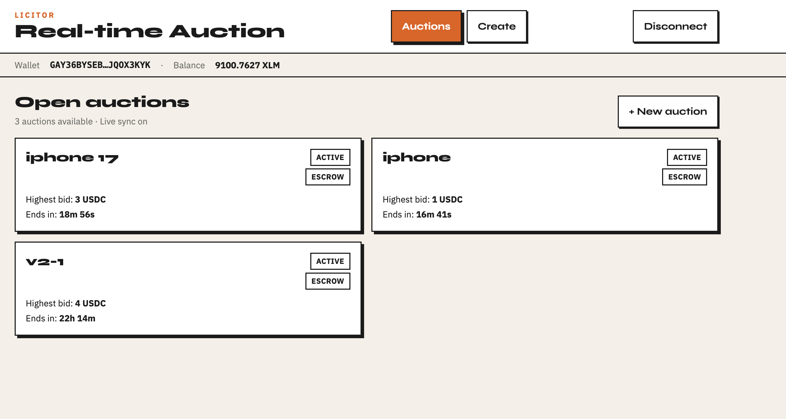
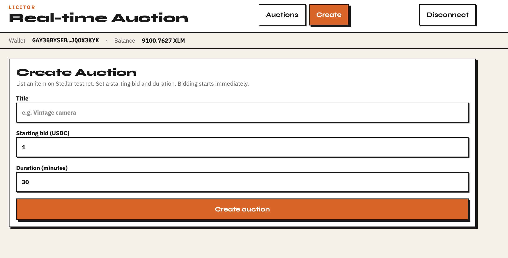
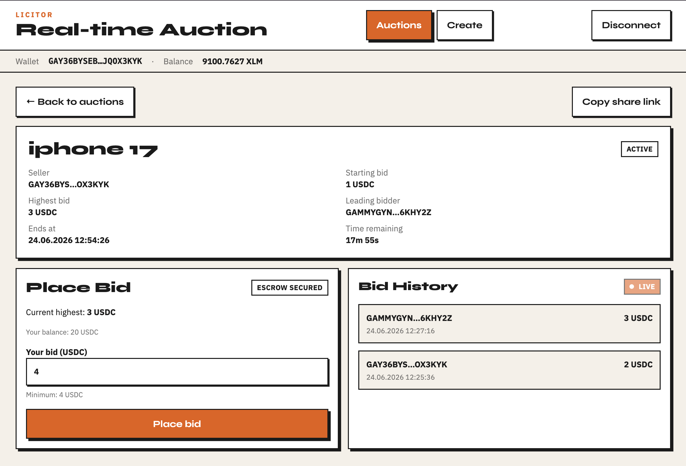

# Licitor - Real-time Auction

[](https://github.com/Caneryy/licitor/actions/workflows/ci.yml)
[](https://github.com/Caneryy/licitor/actions/workflows/deploy-contract.yml)

Stellar testnet live bidding dApp with **escrow-backed USDC bids**, Soroban inter-contract calls, cursor-based `getEvents` sync, and production CI/CD.

**Production:** [https://licitor-psi.vercel.app](https://licitor-psi.vercel.app)

## Demo

<video src="docs/demo-video.mp4" controls width="100%"></video>

## Screenshots

| Landing | Auctions |
|---------|----------|
|  |  |

| Create auction | Auction detail |
|----------------|----------------|
|  |  |

## Features

- **Escrow + SAC payments** — bids lock testnet USDC; outbid users refunded on-chain
- **Two Soroban contracts** — auction orchestration + escrow custody (CPI)
- Multi-wallet support: Freighter, xBull, Lobstr
- Real-time updates via scoped event polling (`bid_placed`, `auction_created`, `auction_finalized`)
- Transaction status tracking (signing → submitting → confirming)
- GitHub Actions CI: contract tests, lint, typecheck, vitest, build
- Manual testnet contract deploy workflow
- Neo-brutalist responsive UI

## Architecture

See [docs/ARCHITECTURE.md](docs/ARCHITECTURE.md) for contract APIs, event flow, and security decisions.

## Deployed contracts (testnet)

Deployed: **2026-06-24**

| Contract | Address |
|----------|---------|
| Auction | [`CDNNII2NQ34FO6A2IBCHSTKJW7L5PPXMQ5IDAWUQ5VJ5ELEEFIAXZ4UB`](https://stellar.expert/explorer/testnet/contract/CDNNII2NQ34FO6A2IBCHSTKJW7L5PPXMQ5IDAWUQ5VJ5ELEEFIAXZ4UB) |
| Escrow | [`CDMCXTJ5S7XOLSVGBFYTL5GFEQAH2ZASXEO47OMZAEWP7EXW4WYSNVIW`](https://stellar.expert/explorer/testnet/contract/CDMCXTJ5S7XOLSVGBFYTL5GFEQAH2ZASXEO47OMZAEWP7EXW4WYSNVIW) |
| USDC (SAC) | [`CBIELTK6YBZJU5UP2WWQEUCYKLPU6AUNZ2BQ4WWFEIE3USCIHMXQDAMA`](https://stellar.expert/explorer/testnet/contract/CBIELTK6YBZJU5UP2WWQEUCYKLPU6AUNZ2BQ4WWFEIE3USCIHMXQDAMA) |

Legacy pre-escrow auction: [`CBKLZBSTFM5YQ27LRDHDA4VTEY4CDCWVSHKOYWZN2X7AIKBKVRRPFGBQ`](https://stellar.expert/explorer/testnet/contract/CBKLZBSTFM5YQ27LRDHDA4VTEY4CDCWVSHKOYWZN2X7AIKBKVRRPFGBQ)

## Prerequisites

- Node.js 20+
- Rust + Stellar CLI
- Funded testnet wallet (XLM for fees + USDC for bids)

## Setup

```bash
npm install
cp .env.example .env
```

Set env vars (values from `deployments/testnet.json`):

```
VITE_AUCTION_CONTRACT_ID=CDNNII2NQ34FO6A2IBCHSTKJW7L5PPXMQ5IDAWUQ5VJ5ELEEFIAXZ4UB
VITE_ESCROW_CONTRACT_ID=CDMCXTJ5S7XOLSVGBFYTL5GFEQAH2ZASXEO47OMZAEWP7EXW4WYSNVIW
VITE_TOKEN_CONTRACT_ID=CBIELTK6YBZJU5UP2WWQEUCYKLPU6AUNZ2BQ4WWFEIE3USCIHMXQDAMA
VITE_CONTRACT_ID=CDNNII2NQ34FO6A2IBCHSTKJW7L5PPXMQ5IDAWUQ5VJ5ELEEFIAXZ4UB
VITE_STELLAR_NETWORK=testnet
```

## Contracts

```bash
make test-contracts
make build-contracts
```

### Deploy to testnet

```bash
export STELLAR_SOURCE=<your-identity>
./scripts/deploy-testnet.sh
```

Writes `deployments/testnet.json`. See [docs/DEPLOYMENT.md](docs/DEPLOYMENT.md).

## Development

```bash
npm run dev
npm run test
npm run typecheck
npm run lint
npm run build
```

## Deploy to Vercel

SPA routes need fallback to `index.html` (`vercel.json`).

1. Import repo at [vercel.com/new](https://vercel.com/new)
2. Set `VITE_*` env vars from `deployments/testnet.json`
3. Deploy

## Live bidding across browsers

1. Open the same auction detail in Browser A and B
2. Browser B places a USDC bid
3. Browser A updates within ~2s via `getEvents` + ledger cursor
4. Bidder sees immediate post-tx refresh locally

## Error handling

- Wallet: not found, rejected, insufficient fee balance, wrong network
- Token: USDC trustline, insufficient USDC for bid
- Contract: auction state errors (#1–#9) mapped from simulation
- Transaction: submission, timeout, restore-required
- UI: Error boundary, retry on list/detail, reconnect for live sync

## Submission checklist

- [x] Multi-wallet dApp on testnet
- [x] Advanced contracts with inter-contract communication (auction ↔ escrow ↔ SAC)
- [x] Event streaming with ledger cursor
- [x] CI/CD pipeline
- [x] Contract + frontend tests
- [x] Deployment scripts + documentation
- [x] Deploy escrow contracts and update Vercel env
