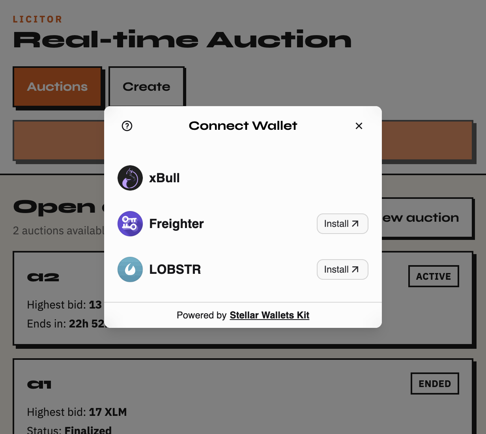

# Licitor - Real-time Auction

Stellar testnet live bidding dApp built with Soroban, StellarWalletsKit, and cursor-based `getEvents` synchronization.

## Submission checklist

### Live demo (optional)

**Production:** [https://licitor-psi.vercel.app](https://licitor-psi.vercel.app)

Deployed on Vercel. Use `/auctions` to browse listings or `/create` to open a new auction.

### Wallet options

Licitor supports multiple wallets via [Stellar Wallets Kit](https://github.com/Creit-Tech/Stellar-WalletsKit):

- Freighter
- xBull
- Lobstr



### Deployed contract address (testnet)

`CBKLZBSTFM5YQ27LRDHDA4VTEY4CDCWVSHKOYWZN2X7AIKBKVRRPFGBQ`

- [View contract on Stellar Expert](https://stellar.expert/explorer/testnet/contract/CBKLZBSTFM5YQ27LRDHDA4VTEY4CDCWVSHKOYWZN2X7AIKBKVRRPFGBQ)

### Sample contract call transaction (testnet)

Example `invoke_host_function` against the auction contract (verifiable on Stellar Expert):

`e79e85f1532b3c8025069ccf540e36f02a7d78a711210e2dca16304835421e98`

- [View transaction on Stellar Expert](https://stellar.expert/explorer/testnet/tx/e79e85f1532b3c8025069ccf540e36f02a7d78a711210e2dca16304835421e98)

Contract deployment transaction:

`8f4985742466ba803a0afcad57eade1440c7a4c54b1e112655a35e7860942fa3`

- [View deploy transaction on Stellar Expert](https://stellar.expert/explorer/testnet/tx/8f4985742466ba803a0afcad57eade1440c7a4c54b1e112655a35e7860942fa3)

## Features

- Multi-wallet support: Freighter, xBull, Lobstr
- Soroban auction contract with on-chain bid history and contract events
- Real-time detail page updates via scoped event listener (`bid_placed`)
- Transaction status tracking in CTA buttons (signing → submitting → confirming)
- Neo-brutalist Lumen UI (responsive)

## Prerequisites

- Node.js 20+
- Rust + Stellar CLI
- A funded testnet wallet

## Setup

```bash
npm install
cp .env.example .env
```

Set `VITE_CONTRACT_ID` after deploying the contract.

## Contract

```bash
CARGO_TARGET_DIR=./target stellar contract build
cargo test -p auction
stellar contract deploy \
  --source-account <your-identity> \
  --network testnet \
  --wasm target/wasm32v1-none/release/auction.wasm
```

Deployed testnet contract for this repo:

`CBKLZBSTFM5YQ27LRDHDA4VTEY4CDCWVSHKOYWZN2X7AIKBKVRRPFGBQ`

## Development

```bash
npm run dev
```

## Deploy to Vercel

Licitor is a Vite SPA. Client-side routes (`/auctions`, `/auction/:id`, `/privacy`, etc.) need a fallback rewrite to `index.html`, which is configured in `vercel.json`.

### Option A: Vercel Dashboard

1. Import the Git repository at [vercel.com/new](https://vercel.com/new)
2. Framework preset: **Vite** (auto-detected)
3. Add environment variables:
   - `VITE_CONTRACT_ID` = your deployed Soroban contract ID
   - `VITE_STELLAR_NETWORK` = `testnet`
4. Deploy

### Option B: Vercel CLI

```bash
npm i -g vercel
vercel login
vercel
```

Set the same environment variables when prompted, or in the project settings:

```bash
vercel env add VITE_CONTRACT_ID
vercel env add VITE_STELLAR_NETWORK
vercel --prod
```

After deployment, open routes like `/`, `/auctions`, and `/privacy` to confirm SPA routing works.

**Live deployment:** [https://licitor-psi.vercel.app](https://licitor-psi.vercel.app)

## Demo: live bidding across browsers

1. Open the same auction detail page in Browser A and Browser B
2. Browser B places a bid
3. Browser A updates automatically within ~5 seconds via `getEvents`
4. Bidder sees immediate post-tx refresh on their own browser

## Architecture notes

Soroban RPC does not provide browser push/WebSocket for contract events. Licitor uses Stellar's recommended pattern: contract emits events on-chain, and open detail pages poll `getEvents` with a ledger cursor while the tab is visible.

## Error handling

Wallet: not found, rejected, insufficient fee balance, wrong network

Contract: auction state errors mapped from simulation

Transaction: submission, timeout, restore-required, account not funded
