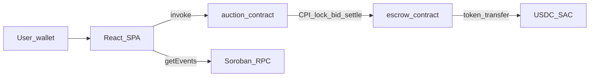

# Licitor Architecture

## Overview

Licitor is a production-oriented Stellar testnet auction dApp with:

- **Auction contract** — on-chain auction state, bid history, events
- **Escrow contract** — SAC (USDC) custody, refunds, seller settlement
- **React SPA** — wallet signing, RPC reads, cursor-based event polling

## Contracts

### Auction (`contracts/auction`)

| Function | Auth | Description |
|----------|------|-------------|
| `create_auction` | seller | Creates auction with starting bid and duration |
| `place_bid` | bidder | Validates bid, calls escrow, updates history |
| `finalize_auction` | seller only | Ends auction, settles escrow to seller |
| `get_auction` | — | Read auction state |
| `get_auction_count` | — | Total auctions created |
| `get_recent_bids` | — | Last 10 bids |

**Events:** `auction_created`, `bid_placed`, `bid_refunded`, `auction_finalized`

### Escrow (`contracts/escrow`)

| Function | Auth | Description |
|----------|------|-------------|
| `set_auction_contract` | admin (once) | Links deployed auction contract |
| `lock_bid` | auction CPI + bidder | Transfers USDC, refunds previous bidder |
| `settle` | auction CPI | Pays seller on finalize |
| `get_locked_balance` | — | Current lock for auction/bidder |

**Events:** `bid_locked`, `bid_refunded`, `auction_settled`

## Deployment order

1. Deploy **escrow** with admin + token SAC ID
2. Deploy **auction** with escrow address
3. Call `escrow.set_auction_contract(auction_id)`

See [DEPLOYMENT.md](./DEPLOYMENT.md).

## Frontend event streaming

Soroban RPC has no browser WebSocket push. Licitor uses:

- `getEvents` with **ledger cursor** in `sessionStorage`
- Visibility-aware polling (pauses when tab hidden)
- Topics: `bid_placed` (detail), `auction_created` / `auction_finalized` (list)

## Security decisions

- Seller-only finalize prevents unauthorized settlement
- Escrow accepts CPI only from configured auction address
- Bidder `require_auth` on auction + escrow for SAC transfers
- Previous bidder refunded automatically on higher bid

## Legacy contract

`CBKLZBSTFM5YQ27LRDHDA4VTEY4CDCWVSHKOYWZN2X7AIKBKVRRPFGBQ` — pre-escrow auction (read-only historical data).
